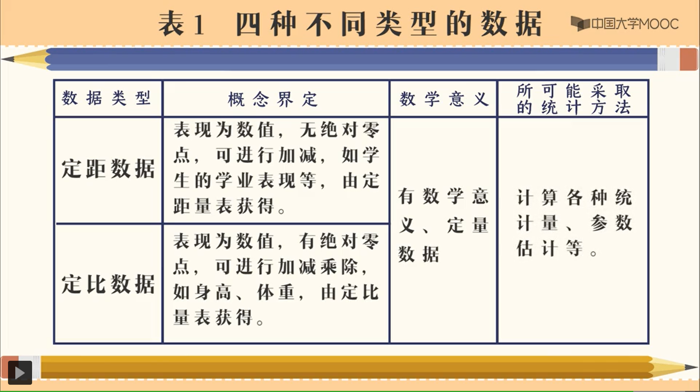
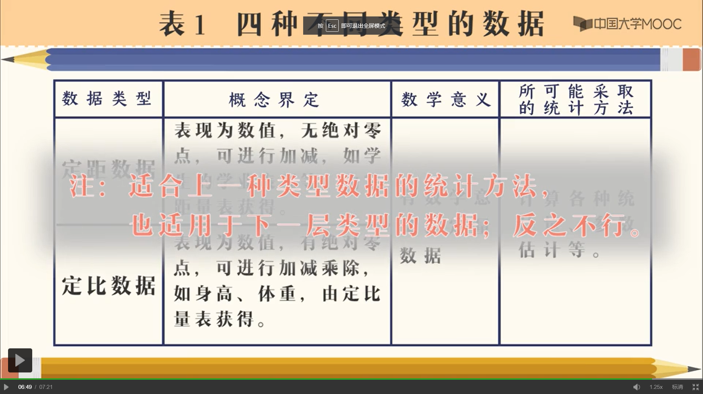
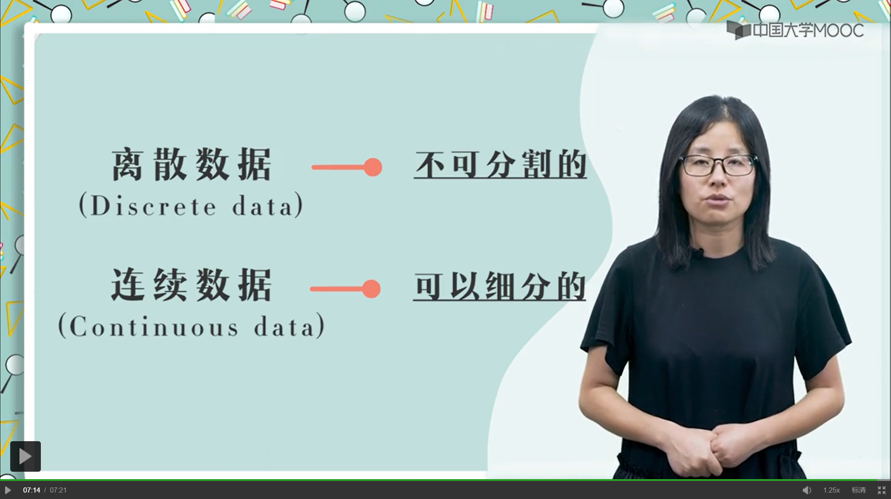

### 第一章 研究伊始
> 链接地址：https://www.icourse163.org/learn/ZJU-1206404806?tid=1450230478#/learn/announce

* 研究三步骤
  * 1.问题的提出
  * 2.解决问题的路径与方法
  * 3.问题的解决

* 使用协方差等统计方法可以对误差进行控制

* 教育研究的基本思路
  * 1.研究缘起，即研究问题的提出。
  * 2.研究设计与方法。
  * 3.研究结果。
  * 4.研究讨论/成效分析。

* 研究假设：“有根据的猜测”或“预感”
  * 1.研究假设通常是以陈述的方式加以表述。
    > 情感对学生的认知是否有影响？ ×

    > 情感对学生的认知有影响 √
  * 2.研究假设应该是可检验的。
    >①研究对象要明确

    >②研究变量能测量
  * 3.一项好的研究假设显示了理论或文献基础。
    >好的研究选题应该具有：①科学性②基于理论或文献回顾提出的
  * 4.可证伪，可重复。证“有”假设而不是证“无”假设
  * 5.清晰地陈述变量间可能存在的关系。

* 研究假设要避免提出：
  >①无相关②无差异③无预测

* 检测研究假设的真实性
  > 在统计假设检验中，一般不能对研究假设的真实性进行检验，而是要建立与研究假设的“零假设（虚无假设）”，通过对“零假设”进行检验作出统计推断。当“零假设”为真时，拒绝研究假设；当“零假设”为假时，接受研究假设。
  
  > 虚无假设：代表两个变量之间的零相关。
  
  > 研究假设：是两个变量间相互关系的明确陈述。

* 研究数据的类型：
  > 不同的数据类型要用不同的统计方法。

  
  
  
  
  